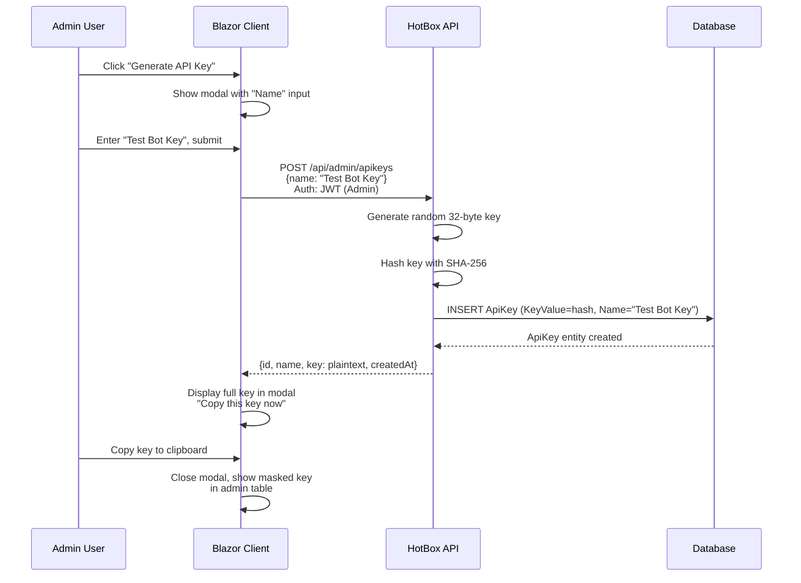
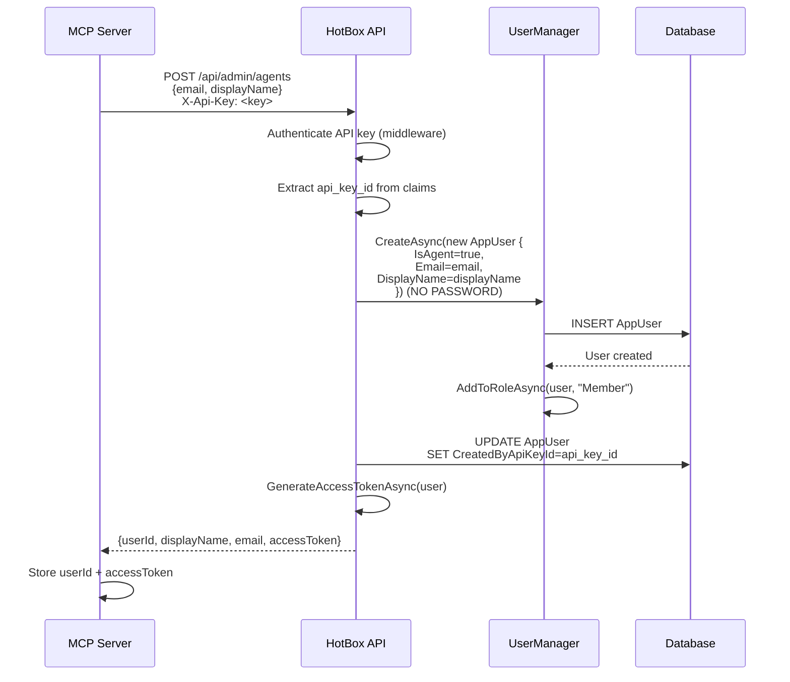
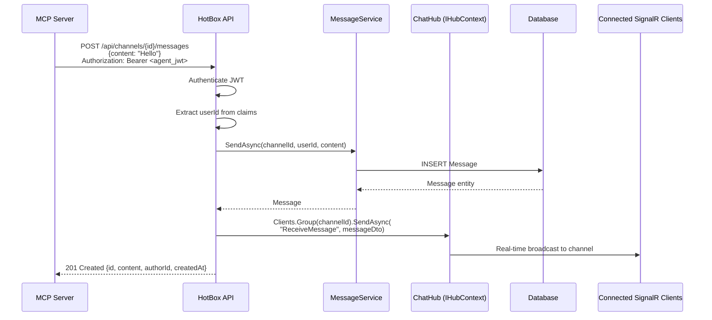
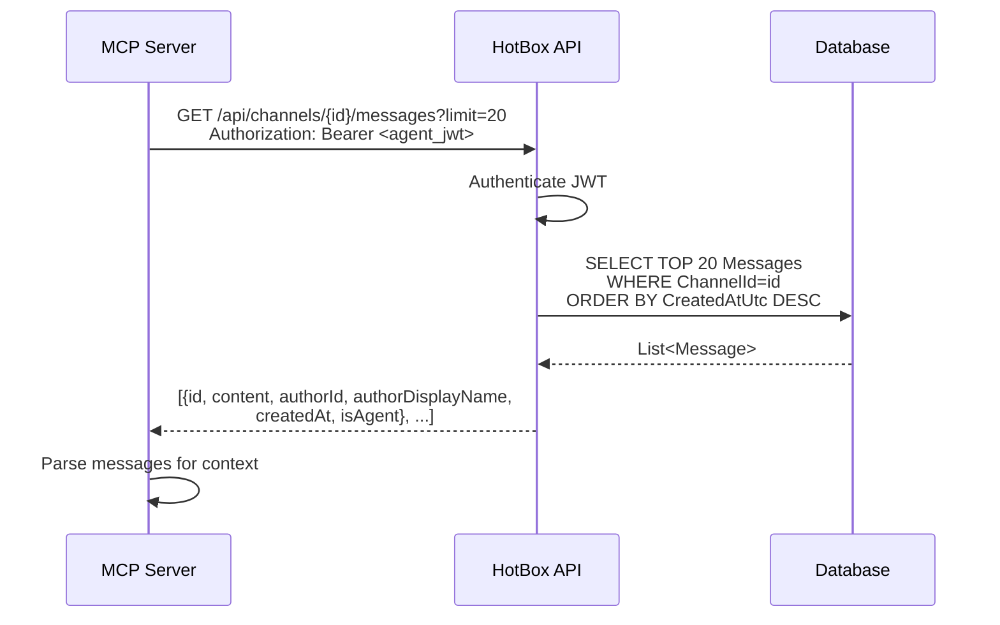

# Architecture: MCP Agent Tools

**Status**: Phase 0 Complete — Design Approved
**Date**: 2026-02-12
**Requirements**: `docs/requirements/mcp-agent-tools.md`
**Domain Reviews**: `docs/architecture/reviews/{platform,auth-security,messaging,client-experience}-mcp-review.md`

---

## 1. Overview

The MCP Agent Tools feature enables AI agents to create accounts and interact with HotBox programmatically through a Model Context Protocol (MCP) server. The primary purpose is testing and simulation — allowing developers to spin up multiple agent users to stress test, validate real-time behavior, and simulate realistic multi-user activity without manual account creation.

The feature introduces:
- API key-based authentication for agent management
- Agent user accounts (passwordless, distinguished by `IsAgent` flag)
- A standalone MCP server project that communicates with HotBox over HTTP/SignalR
- Admin UI for API key management and agent user visualization

This infrastructure also serves as the foundation for future bot and integration capabilities.

---

## 2. Data Model Changes

### 2.1 New Entities

#### ApiKey Entity

Location: `src/HotBox.Core/Entities/ApiKey.cs`

```csharp
public class ApiKey
{
    public Guid Id { get; init; }

    public string KeyValue { get; set; } = string.Empty; // SHA-256 hash of actual key

    public string Name { get; set; } = string.Empty; // Human-readable label

    public DateTime CreatedAtUtc { get; set; }

    public DateTime? RevokedAtUtc { get; set; }

    public string? RevokedReason { get; set; }

    // Computed properties
    public bool IsRevoked => RevokedAtUtc.HasValue;
    public bool IsActive => !IsRevoked;

    // Navigation property
    public ICollection<AppUser> CreatedAgents { get; set; } = [];
}
```

**Key Design Decisions:**
- `KeyValue` stores a **SHA-256 hash**, not plaintext (security best practice)
- `Name` provides a human-readable label (e.g., "MCP Testing", "Production Bot Key")
- Revocation pattern matches `RefreshToken` entity (nullable `RevokedAtUtc` + reason)
- One API key can create multiple agent accounts (one-to-many relationship)

### 2.2 AppUser Entity Extensions

Location: `src/HotBox.Core/Entities/AppUser.cs`

Add the following properties:

```csharp
public bool IsAgent { get; set; } = false;

public Guid? CreatedByApiKeyId { get; set; }

public ApiKey? CreatedByApiKey { get; set; }
```

**Rationale:**
- `IsAgent` flag distinguishes agent users from human users (for UI display, filtering, analytics)
- Foreign key relationship tracks which API key created each agent (audit trail, scoping)
- Nullable `CreatedByApiKeyId` supports future manual agent creation by admins (not tied to a key)

### 2.3 Entity Relationship Diagram

```
┌─────────────────┐
│     ApiKey      │
│─────────────────│
│ Id (PK)         │
│ KeyValue (hash) │◄──────┐
│ Name            │       │
│ CreatedAtUtc    │       │
│ RevokedAtUtc?   │       │ One-to-Many
│ RevokedReason?  │       │
└─────────────────┘       │
                          │
                          │
┌─────────────────────────┼─────────┐
│          AppUser        │         │
│─────────────────────────┼─────────│
│ Id (PK)                 │         │
│ UserName                │         │
│ DisplayName             │         │
│ IsAgent ◄───────────────┘         │
│ CreatedByApiKeyId (FK)            │
└───────────────────────────────────┘
```

**Delete Behavior:** `OnDelete(DeleteBehavior.SetNull)`
When an API key is deleted, agent accounts are **not** deleted — their `CreatedByApiKeyId` is set to NULL. This preserves agent user data while allowing API key cleanup.

---

## 3. API Key Entity Design

### 3.1 Properties and Types

| Property | Type | Constraints | Description |
|----------|------|-------------|-------------|
| `Id` | `Guid` | Primary Key, auto-generated | Unique identifier |
| `KeyValue` | `string` | Required, Max 256 chars, Unique | SHA-256 hash of API key |
| `Name` | `string` | Required, Max 100 chars | Human-readable label |
| `CreatedAtUtc` | `DateTime` | Required | Creation timestamp |
| `RevokedAtUtc` | `DateTime?` | Nullable | Revocation timestamp |
| `RevokedReason` | `string?` | Nullable, Max 500 chars | Revocation reason |
| `IsRevoked` | `bool` | Computed (not persisted) | `RevokedAtUtc.HasValue` |
| `IsActive` | `bool` | Computed (not persisted) | `!IsRevoked` |

### 3.2 Key Generation and Hashing

**Generation:**
```csharp
public static string GenerateApiKey()
{
    var keyBytes = new byte[32]; // 256 bits
    RandomNumberGenerator.Fill(keyBytes);
    return Convert.ToBase64String(keyBytes); // 44-character string
}
```

**Hashing (before storage):**
```csharp
using System.Security.Cryptography;
using System.Text;

public static string HashApiKey(string plaintextKey)
{
    var keyBytes = Encoding.UTF8.GetBytes(plaintextKey);
    var hashBytes = SHA256.HashData(keyBytes);
    return Convert.ToBase64String(hashBytes);
}
```

**Verification (in middleware):**
```csharp
var storedHashedKey = await dbContext.ApiKeys
    .FirstOrDefaultAsync(k => k.KeyValue == HashApiKey(incomingKey) && k.IsActive);
```

**Display Pattern:**
- Full key displayed **once** to admin at creation (via modal with copy button)
- Admin table shows masked key: `••••••••abcd1234` (last 8 chars visible)
- Key cannot be retrieved after creation (same pattern as GitHub Personal Access Tokens)

### 3.3 EF Core Configuration

Location: `src/HotBox.Infrastructure/Data/Configurations/ApiKeyConfiguration.cs`

```csharp
public class ApiKeyConfiguration : IEntityTypeConfiguration<ApiKey>
{
    public void Configure(EntityTypeBuilder<ApiKey> builder)
    {
        builder.HasKey(a => a.Id);

        builder.Property(a => a.Id).ValueGeneratedOnAdd();

        builder.Property(a => a.KeyValue)
            .IsRequired()
            .HasMaxLength(256);

        builder.Property(a => a.Name)
            .IsRequired()
            .HasMaxLength(100);

        builder.Property(a => a.CreatedAtUtc).IsRequired();

        builder.Property(a => a.RevokedReason).HasMaxLength(500);

        builder.Ignore(a => a.IsRevoked);
        builder.Ignore(a => a.IsActive);

        builder.HasIndex(a => a.KeyValue).IsUnique();

        builder.HasMany(a => a.CreatedAgents)
            .WithOne(u => u.CreatedByApiKey)
            .HasForeignKey(u => u.CreatedByApiKeyId)
            .OnDelete(DeleteBehavior.SetNull);
    }
}
```

**Migration Considerations:**
- Multi-provider support: SQLite (dev), PostgreSQL/MySQL/MariaDB (prod)
- `SetNull` behavior supported in all target providers
- Unique constraint on `KeyValue` prevents hash collisions (statistically improbable with SHA-256)

---

## 4. Authentication Middleware

### 4.1 Dual Authentication Scheme Design

HotBox currently uses JWT Bearer authentication. The MCP feature adds API key authentication as a **second scheme** without replacing or breaking existing JWT auth.

**Approach:** Use ASP.NET Core's `AddPolicyScheme` to support both JWT and API Key authentication simultaneously.

### 4.2 Authentication Scheme Configuration

Location: `src/HotBox.Application/DependencyInjection/ApplicationServiceExtensions.cs`

```csharp
services.AddAuthentication(options =>
{
    options.DefaultAuthenticateScheme = "JwtOrApiKey";
    options.DefaultChallengeScheme = "JwtOrApiKey";
})
.AddJwtBearer(JwtBearerDefaults.AuthenticationScheme, options =>
{
    // Existing JWT configuration
})
.AddScheme<ApiKeyAuthenticationOptions, ApiKeyAuthenticationHandler>("ApiKey", options => { })
.AddPolicyScheme("JwtOrApiKey", "JWT or API Key", options =>
{
    options.ForwardDefaultSelector = context =>
    {
        if (context.Request.Headers.ContainsKey("X-Api-Key"))
        {
            return "ApiKey";
        }
        return JwtBearerDefaults.AuthenticationScheme;
    };
});
```

**How it works:**
1. Incoming request is inspected for `X-Api-Key` header
2. If present, `ApiKeyAuthenticationHandler` is invoked
3. Otherwise, existing JWT Bearer handler is invoked
4. All existing `[Authorize]` attributes work with both schemes

### 4.3 API Key Authentication Handler

Location: `src/HotBox.Application/Authentication/ApiKeyAuthenticationHandler.cs`

```csharp
public class ApiKeyAuthenticationHandler : AuthenticationHandler<ApiKeyAuthenticationOptions>
{
    private readonly HotBoxDbContext _dbContext;

    public ApiKeyAuthenticationHandler(
        IOptionsMonitor<ApiKeyAuthenticationOptions> options,
        ILoggerFactory logger,
        UrlEncoder encoder,
        HotBoxDbContext dbContext)
        : base(options, logger, encoder)
    {
        _dbContext = dbContext;
    }

    protected override async Task<AuthenticateResult> HandleAuthenticateAsync()
    {
        if (!Request.Headers.TryGetValue("X-Api-Key", out var extractedApiKey))
        {
            return AuthenticateResult.NoResult();
        }

        var hashedKey = HashApiKey(extractedApiKey.ToString());
        var apiKey = await _dbContext.ApiKeys
            .FirstOrDefaultAsync(k => k.KeyValue == hashedKey && k.IsActive);

        if (apiKey == null)
        {
            Logger.LogWarning("Invalid or revoked API key attempted");
            return AuthenticateResult.Fail("Invalid API key");
        }

        var claims = new[]
        {
            new Claim("auth_method", "api_key"),
            new Claim("api_key_id", apiKey.Id.ToString()),
            new Claim("api_key_name", apiKey.Name)
        };

        var identity = new ClaimsIdentity(claims, "ApiKey");
        var principal = new ClaimsPrincipal(identity);
        var ticket = new AuthenticationTicket(principal, "ApiKey");

        Logger.LogInformation("API key authenticated: {ApiKeyName} ({ApiKeyId})",
            apiKey.Name, apiKey.Id);

        return AuthenticateResult.Success(ticket);
    }

    private static string HashApiKey(string key) { /* SHA-256 hashing */ }
}
```

### 4.4 Header Format

**Standard:** `X-Api-Key: <key>`

**Rationale:**
- `X-Api-Key` is a common convention in REST APIs
- Avoids conflict with existing `Authorization: Bearer <token>` header
- Simple for MCP server to construct
- Clear separation of concerns (API keys vs user tokens)

**Future Enhancement:** Support `Authorization: ApiKey <key>` for tools that enforce `Authorization` header usage.

### 4.5 Claims Structure

**API Key Authentication Claims:**

| Claim Type | Value | Purpose |
|------------|-------|---------|
| `auth_method` | `"api_key"` | Identifies authentication method (vs JWT) |
| `api_key_id` | `<Guid>` | Links to `ApiKey` entity |
| `api_key_name` | `<string>` | Human-readable key label (for logging) |

**No `ClaimTypes.NameIdentifier`:** API keys authenticate the **MCP server**, not a specific user. User-specific claims are added only when the MCP server creates an agent account and receives a JWT for that agent.

---

## 5. MCP Server Project Structure

### 5.1 Project Location

Solution structure:

```
src/
├── HotBox.Core/
├── HotBox.Infrastructure/
├── HotBox.Application/
├── HotBox.Client/
└── HotBox.Mcp/           ← NEW
    ├── HotBox.Mcp.csproj
    ├── Program.cs
    ├── Tools/
    │   ├── CreateAgentAccountTool.cs
    │   ├── ListAgentAccountsTool.cs
    │   ├── SendMessageTool.cs
    │   ├── SendDirectMessageTool.cs
    │   ├── ReadMessagesTool.cs
    │   └── ReadDirectMessagesTool.cs
    ├── Clients/
    │   └── HotBoxApiClient.cs
    └── appsettings.json
```

### 5.2 Project References

**HotBox.Mcp has ZERO internal project references.**

**Dependencies:**
- NuGet packages for MCP protocol implementation
- HTTP client libraries (`System.Net.Http`)

**Rationale:**
The MCP server communicates with HotBox over its **public API surface** (REST endpoints and SignalR hubs). This approach:
- Validates that the public API is sufficient for external integrations
- Exercises the real authentication and authorization stack
- Avoids coupling the MCP server to HotBox's internal implementation
- Mimics how real third-party bots will integrate

### 5.3 Communication Pattern

**REST-First Approach:**

The MCP server uses REST endpoints for all operations:
- Agent account creation: `POST /api/admin/agents`
- Message sending: `POST /api/channels/{id}/messages`, `POST /api/dm/{userId}/messages`
- Message reading: `GET /api/channels/{id}/messages`, `GET /api/dm/{userId}`

**SignalR for Real-Time (Future):** Phase 3 may add SignalR connections for real-time message subscriptions, but Phase 1 and 2 are REST-only.

**Authentication:** All requests include `X-Api-Key: <key>` header for initial agent creation. Once an agent account exists, the MCP server can obtain a JWT for that agent to send messages.

### 5.4 Docker Considerations

**Not part of docker-compose:** The MCP server is a developer tool that runs locally (either on host machine or in a separate container). It connects to HotBox via HTTP (either `localhost:5000` for local dev or `http://hotbox:8080` for Docker network).

No changes to `docker-compose.yml` required.

---

## 6. Key Flows

### 6.1 API Key Creation Flow



**Key Points:**
- Plaintext key returned **once** to client, never stored or retrievable again
- Hash stored in database for authentication
- Admin table shows masked key: `••••••••abcd1234`

### 6.2 Agent Account Creation Flow



**Key Points:**
- Agent accounts created **without passwords** (passwordless users)
- Default role: `Member` (same permissions as regular users)
- JWT returned immediately for message sending
- Foreign key tracks which API key created the agent

### 6.3 Agent Sending a Message Flow



**Key Points:**
- Agent authenticates with JWT (not API key) for message sending
- REST endpoint used instead of SignalR hub method
- Real-time broadcast still occurs via `IHubContext<ChatHub>`
- Human users receive agent messages in real-time

### 6.4 Agent Reading Messages Flow



**Key Points:**
- Standard pagination endpoint (no special agent logic)
- Response includes `isAgent` flag for message attribution
- Pull-based reading (no SignalR subscription in Phase 1/2)

---

## 7. Admin UI

### 7.1 API Key Management Component

**Location:** `src/HotBox.Client/Components/Admin/AdminApiKeyManagement.razor`

**Features:**
- Generate new API key (modal with "Name" input)
- List all API keys (table with columns: Name, Key, Created, Agents, Status, Actions)
- Revoke API key (confirmation modal)
- Copy key to clipboard (only visible once at creation)

**Table Structure:**

| Name | Key | Created | Agents | Status | Actions |
|------|-----|---------|--------|--------|---------|
| Test Bot Key | `••••••••abcd1234` | 2026-02-11 | 3 | Active | [Revoke] |
| Production Bot | `••••••••xyz5678` | 2026-02-10 | 12 | Revoked | - |

**Key Display Pattern:**
- Admin table: Masked (`••••••••` + last 8 chars)
- Post-creation modal: Full key with copy button and warning

**CSS Tokens:**
```css
--bot-badge-bg: rgba(93, 228, 199, 0.12);
--bot-badge-color: var(--accent);
```

### 7.2 Agent User Display

#### Member List (MembersPanel.razor)

**BOT Badge Treatment:**

```
┌─────────────────────────────┐
│ ONLINE (3)                  │
├─────────────────────────────┤
│ ● Alice                     │
│ ● Bob          BOT  Admin   │
│ ● Charlie                   │
└─────────────────────────────┘
```

**Badge Design:**
- Font: Monospace, 8px, uppercase
- Background: `rgba(93, 228, 199, 0.15)`
- Color: `var(--accent)`
- Placement: Between display name and role tag

**Accessibility:** Screen reader announces "Bob, Online, Bot, Admin"

#### Chat Messages (MessageList.razor)

**Message Header:**

```
Bob  BOT  2:45 PM
Hello, I'm a bot!
```

**Badge Design:**
- Same styling as member list badge
- Placement: After author name, before timestamp
- Screen reader support: `<span class="visually-hidden">Bot</span>`

### 7.3 Avatar Treatment

**Phase 1:** Agent users use the same hash-based colored avatar with initials as human users. The BOT badge provides sufficient visual distinction.

**Future Enhancement (Phase 2):** Replace agent avatars with a fixed bot icon (robot face SVG).

---

## 8. Cross-Domain Decisions

### 8.1 Consensus Decisions

All four domain reviews agreed on:

1. **API Key Hashing:** Store SHA-256 hash, display plaintext key only once at creation
2. **`IsAgent` Flag:** Add boolean to `AppUser` entity (default `false`)
3. **Passwordless Agent Accounts:** Use `UserManager.CreateAsync(user)` without password parameter
4. **REST-First Approach:** MCP server uses REST endpoints, not SignalR (for simplicity and testability)
5. **Default Role:** Agent users assigned `Member` role (same permissions as regular users)
6. **BOT Badge:** Visual distinction via small badge in member lists and chat messages
7. **One Key → Many Agents:** One API key can create multiple agent accounts

### 8.2 Resolved Tensions

#### Header Format: Middleware vs `Authorization` Header

**Tension:** Platform suggested custom middleware; Auth-Security preferred `AddScheme` handler.

**Resolution:** Use `AddScheme<ApiKeyAuthenticationHandler>` with `AddPolicyScheme` to support both JWT and API Key. Middleware-only approach bypasses ASP.NET Core's authentication pipeline and breaks `[Authorize]` attributes.

#### Real-Time Broadcast for REST-Posted Messages

**Tension:** Messaging domain flagged that REST-based message posting bypasses SignalR broadcast.

**Resolution:** Add `IHubContext<ChatHub>` to `MessagesController` (or `MessageService`) to manually broadcast REST-posted messages to SignalR groups. This ensures human users receive agent messages in real-time.

#### API Key Ownership

**Tension:** Auth-Security suggested tying API keys to admin users; Platform recommended keys be independent.

**Resolution:** Phase 1 follows requirements: API keys are **not** tied to a specific admin user. Phase 2 can optionally add `CreatedByUserId` for audit trails.

#### Agent User Notifications

**Tension:** Messaging domain raised concern about @mention notifications for agent messages spamming users.

**Resolution:** Add a check to `NotificationService` to skip notifications for messages authored by agents (`if (author.IsAgent) return;`). This prevents agent messages from triggering desktop/push notifications.

### 8.3 Coordination Points

| Area | Domains Involved | Decision |
|------|------------------|----------|
| **ApiKey entity and migration** | Platform, Auth-Security | Platform owns entity + configuration; Auth owns authentication handler |
| **Agent account creation endpoint** | Auth-Security, Platform | Auth owns `POST /api/admin/agents` controller; Platform provides `IApiKeyRepository` |
| **Message sending via REST** | Messaging | Messaging adds `POST /api/channels/{id}/messages` endpoint with `IHubContext` broadcast |
| **BOT badge rendering** | Client Experience, Auth-Security | Client Experience owns Blazor components; Auth ensures `IsAgent` in DTOs |
| **Rate limiting** | Platform | Platform owns middleware; applies to all API key-authenticated requests |

---

## 9. Security Considerations

### 9.1 API Key Hashing

**Storage:** SHA-256 hash stored in `ApiKey.KeyValue` column (max 256 chars).

**Generation:**
```csharp
var keyBytes = new byte[32];
RandomNumberGenerator.Fill(keyBytes);
var plaintextKey = Convert.ToBase64String(keyBytes); // 44 chars
var hashedKey = Convert.ToBase64String(SHA256.HashData(Encoding.UTF8.GetBytes(plaintextKey)));
```

**Verification:**
```csharp
var incomingHash = Convert.ToBase64String(SHA256.HashData(Encoding.UTF8.GetBytes(incomingKey)));
var apiKey = await dbContext.ApiKeys.FirstOrDefaultAsync(k => k.KeyValue == incomingHash && k.IsActive);
```

**Why SHA-256 (not bcrypt)?** Bcrypt is intentionally slow (for password brute-force protection). API key verification happens on every request — speed is critical. SHA-256 is fast and collision-resistant. Keys are 256-bit random (not user-chosen), so dictionary attacks are infeasible.

### 9.2 Rate Limiting

**Requirement:** Prevent API key abuse (unlimited agent creation, message flooding).

**Approach:**
- Add rate limiting middleware (Platform responsibility)
- Different policies for API key vs JWT auth
- Suggested limits:
  - Agent creation: 10 accounts per hour per API key
  - Message sending: 10 messages per minute per agent (configurable)
  - DMs: 30 messages per minute per conversation

**Implementation:** Use ASP.NET Core built-in rate limiting (Microsoft.AspNetCore.RateLimiting) or `AspNetCoreRateLimit` package.

### 9.3 Agent Permissions

**Default Role:** `Member`

**Permissions Granted:**
- Send messages to text channels
- Send direct messages
- Read message history
- Join/leave channels

**Permissions Denied:**
- Create/delete channels (Moderator-only)
- Kick users (Moderator-only)
- Change server settings (Admin-only)
- Generate invite codes (Admin-only)

**Future Enhancement:** Add `[Authorize(Policy = "NotAgent")]` to restrict specific actions (e.g., agents cannot vote in polls, cannot create channels even if promoted to Moderator).

### 9.4 Key Revocation Behavior

**When an API key is revoked:**
- `RevokedAtUtc` is set to current timestamp
- Key immediately fails authentication (middleware checks `IsActive`)
- Existing agent accounts **remain active** (not deleted)
- Agent JWTs issued before revocation **continue to work** until they expire (15 min)
- API key cannot create new agents
- Revoked keys cannot be un-revoked (permanent)

**Agent Account Cleanup:** Admins can manually delete agent accounts via `DELETE /api/admin/users/{id}` if cleanup is needed.

---

## 10. Open Questions Resolved

### 10.1 API Key Header Format

**Decision:** `X-Api-Key: <key>` (custom header)

**Rationale:**
- Common convention in REST APIs
- Avoids conflict with existing `Authorization: Bearer <token>` header
- Simple for MCP server to construct

**Future Enhancement:** Support `Authorization: ApiKey <key>` for tools that require `Authorization` header.

### 10.2 Agent Account Creation Approach

**Decision:** Passwordless accounts via `UserManager.CreateAsync(user)` (no password parameter)

**Rationale:**
- ASP.NET Identity supports password-less accounts
- Agents authenticate via API key (to get JWT), not email/password
- Prevents manual login to agent accounts (security best practice)

**JWT Issuance:** Agent creation endpoint returns a JWT immediately, allowing MCP server to send messages without a separate login call.

### 10.3 MCP Server Communication Approach

**Decision:** REST-first (HTTP only in Phase 1 and 2)

**Rationale:**
- Validates public API surface
- Simpler than SignalR connection management
- Exercises authentication and authorization stack
- Pull-based message reading fits testing use case

**Future Enhancement (Phase 3):** Add SignalR connections for real-time message subscriptions and typing indicators.

### 10.4 Real-Time Broadcast for REST-Posted Messages

**Decision:** Add `IHubContext<ChatHub>` to `MessagesController` or `MessageService`

**Rationale:**
- Human users expect real-time delivery for all messages (agent or human)
- REST-posted messages must trigger SignalR broadcast to maintain feature parity
- `IHubContext` allows manual broadcast without requiring SignalR connection

**Implementation:**
```csharp
await _hubContext.Clients.Group(channelId.ToString())
    .SendAsync("ReceiveMessage", messageDto);
```

### 10.5 Agent Notification Behavior

**Decision:** Skip @mention notifications for agent-authored messages

**Rationale:**
- Prevents notification spam during testing (Phase 3 simulations with 5-10 agents)
- Agents are not real users — notifying humans about agent activity is low-value

**Implementation:** Add check in `NotificationService`:
```csharp
if (message.Author.IsAgent) return; // Skip notifications for agent messages
```

---

## 11. Implementation Checklist

### Phase 1: API Key Infrastructure

**Platform Domain:**
- [ ] Create `ApiKey` entity in `src/HotBox.Core/Entities/ApiKey.cs`
- [ ] Update `AppUser` with `IsAgent`, `CreatedByApiKeyId`, `CreatedByApiKey`
- [ ] Create `ApiKeyConfiguration` in `src/HotBox.Infrastructure/Data/Configurations/`
- [ ] Update `AppUserConfiguration` with new properties
- [ ] Update `HotBoxDbContext` with `DbSet<ApiKey>`
- [ ] Generate migration: `dotnet ef migrations add AddApiKeyEntity`
- [ ] Test migration on SQLite and PostgreSQL
- [ ] Create `IApiKeyRepository` and `ApiKeyRepository`
- [ ] Register repository in `InfrastructureServiceExtensions.cs`
- [ ] Create `ApiKeyOptions` class
- [ ] Add rate limiting middleware (optional for Phase 1, required for Phase 2)

**Auth & Security Domain:**
- [ ] Create `ApiKeyAuthenticationHandler` in `src/HotBox.Application/Authentication/`
- [ ] Create `ApiKeyAuthenticationOptions`
- [ ] Update `ApplicationServiceExtensions.cs` with dual auth scheme (`AddPolicyScheme`)
- [ ] Create `POST /api/admin/apikeys` endpoint (generate key)
- [ ] Create `GET /api/admin/apikeys` endpoint (list keys)
- [ ] Create `DELETE /api/admin/apikeys/{id}` endpoint (revoke key)
- [ ] Create `POST /api/admin/agents` endpoint (create agent account)
- [ ] Create `GET /api/admin/agents` endpoint (list agents per key)
- [ ] Update `AdminUserResponse` DTO to include `IsAgent`

**Messaging Domain:**
- [ ] Add `POST /api/channels/{id}/messages` endpoint to `MessagesController`
- [ ] Add `IHubContext<ChatHub>` to `MessagesController` or `MessageService`
- [ ] Broadcast REST-posted messages to SignalR groups
- [ ] Update `MessageDto` to include `IsAgent` flag
- [ ] Update `NotificationService` to skip notifications for agent messages

**Client Experience Domain:**
- [ ] Create `AdminApiKeyManagement.razor` component
- [ ] Add API key section to admin sidebar navigation
- [ ] Add `IsAgent` to `UserPresenceInfo`, `MessageDto`, `AdminUserResponse` DTOs
- [ ] Update `MembersPanel.razor` to show BOT badge
- [ ] Update `MessageList.razor` to show BOT badge next to author name
- [ ] Add CSS for `.member-bot-badge`, `.msg-bot-badge`, `.api-key-masked`, `.api-key-display`
- [ ] Add `--bot-badge-bg` and `--bot-badge-color` design tokens
- [ ] Add screen-reader support for bot labels
- [ ] Implement API key copy-to-clipboard, masking, and revocation flow

### Phase 2: MCP Server & Tools

- [ ] Add `HotBox.Mcp` project to solution (no internal project references)
- [ ] Create `HotBoxApiClient` for HTTP communication
- [ ] Implement 6 MCP tools:
  - [ ] `create_agent_account`
  - [ ] `list_agent_accounts`
  - [ ] `send_message`
  - [ ] `send_direct_message`
  - [ ] `read_messages`
  - [ ] `read_direct_messages`
- [ ] Document MCP server setup in `docs/mcp-server-setup.md`

### Phase 3: Agent Simulation & Orchestration

- [ ] Implement simulation loop (wait → read → reply)
- [ ] LLM-driven message generation
- [ ] Configurable agent personalities
- [ ] Document simulation workflow in `docs/agent-simulation.md`

---

## 12. File Paths Reference

| File | Purpose | Domain |
|------|---------|--------|
| `src/HotBox.Core/Entities/ApiKey.cs` | ApiKey entity definition | Platform |
| `src/HotBox.Core/Entities/AppUser.cs` | AppUser entity (add `IsAgent` flag) | Auth-Security |
| `src/HotBox.Infrastructure/Data/Configurations/ApiKeyConfiguration.cs` | EF Core configuration | Platform |
| `src/HotBox.Infrastructure/Data/Configurations/AppUserConfiguration.cs` | Update for `IsAgent` | Platform |
| `src/HotBox.Infrastructure/Data/HotBoxDbContext.cs` | Add `DbSet<ApiKey>` | Platform |
| `src/HotBox.Core/Interfaces/IApiKeyRepository.cs` | Repository interface | Platform |
| `src/HotBox.Infrastructure/Repositories/ApiKeyRepository.cs` | Repository implementation | Platform |
| `src/HotBox.Core/Options/ApiKeyOptions.cs` | Options class | Platform |
| `src/HotBox.Application/Authentication/ApiKeyAuthenticationHandler.cs` | Auth handler | Auth-Security |
| `src/HotBox.Application/Authentication/ApiKeyAuthenticationOptions.cs` | Auth options | Auth-Security |
| `src/HotBox.Application/DependencyInjection/ApplicationServiceExtensions.cs` | Dual auth scheme setup | Auth-Security |
| `src/HotBox.Application/Controllers/AdminController.cs` | Agent management endpoints | Auth-Security |
| `src/HotBox.Application/Controllers/MessagesController.cs` | Add `POST /channels/{id}/messages` | Messaging |
| `src/HotBox.Client/Components/Admin/AdminApiKeyManagement.razor` | API key admin UI | Client Experience |
| `src/HotBox.Client/Components/Chat/MembersPanel.razor` | Add BOT badge | Client Experience |
| `src/HotBox.Client/Components/Chat/MessageList.razor` | Add BOT badge to messages | Client Experience |
| `src/HotBox.Client/wwwroot/css/app.css` | Bot badge CSS tokens | Client Experience |

---

## 13. Testing Strategy

### Unit Tests

- `ApiKeyRepository` CRUD operations
- `ApiKeyAuthenticationHandler` authentication logic (valid key, revoked key, invalid key)
- Agent account creation (passwordless, role assignment, API key linkage)

### Integration Tests

- API key creation → authentication → agent creation flow
- REST message posting → SignalR broadcast verification
- API key revocation → authentication failure

### Multi-Provider Tests

- Run migrations on SQLite, PostgreSQL, MySQL
- Verify `SetNull` FK behavior on all providers
- Test unique constraint on `KeyValue` across providers

### UI Tests

- API key generation modal → copy to clipboard
- BOT badge rendering in member list and chat messages
- Masked key display in admin table
- Screen reader announcements for agent users

---

## 14. Conclusion

The MCP Agent Tools architecture is designed to integrate cleanly with HotBox's existing three-layer architecture, multi-provider database support, and dual authentication schemes. The feature introduces minimal new infrastructure (one entity, one authentication handler, one admin component) while leveraging established patterns for entity configuration, repository design, and UI conventions.

**Key Strengths:**
- REST-first approach validates public API surface
- Dual authentication scheme preserves existing JWT flow
- SHA-256 hashing provides security without performance overhead
- BOT badge provides clear visual distinction without UI clutter
- Passwordless agent accounts prevent manual login abuse

**Next Steps:**
1. Platform domain implements `ApiKey` entity and migration
2. Auth-Security domain implements authentication handler and admin endpoints
3. Messaging domain adds REST endpoint for channel messages with SignalR broadcast
4. Client Experience domain builds admin UI and BOT badge rendering
5. Phase 2: MCP server implementation with 6 tools
6. Phase 3: Agent simulation and orchestration

All domain reviews approved this architecture with no blocking concerns. Implementation can proceed to Phase 1.
