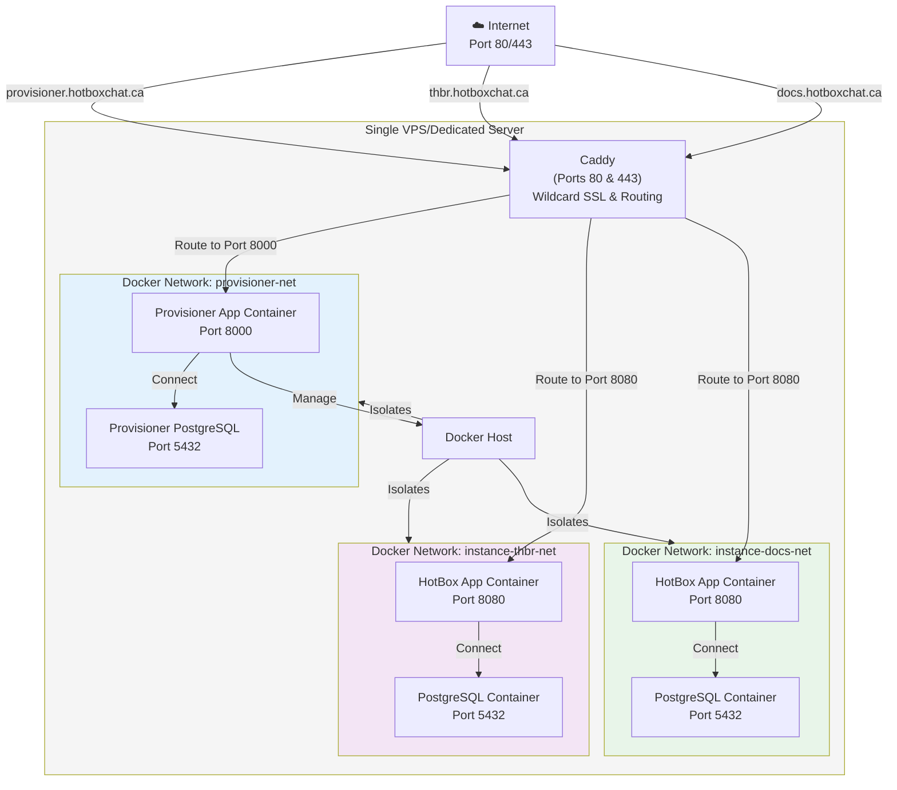
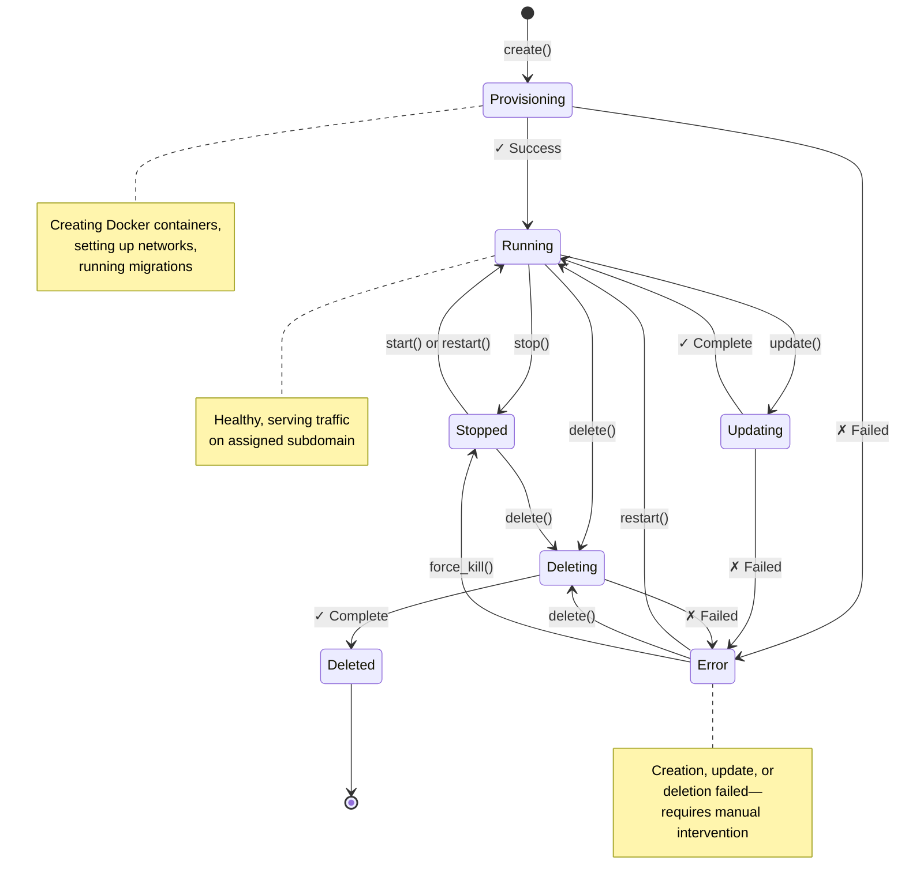
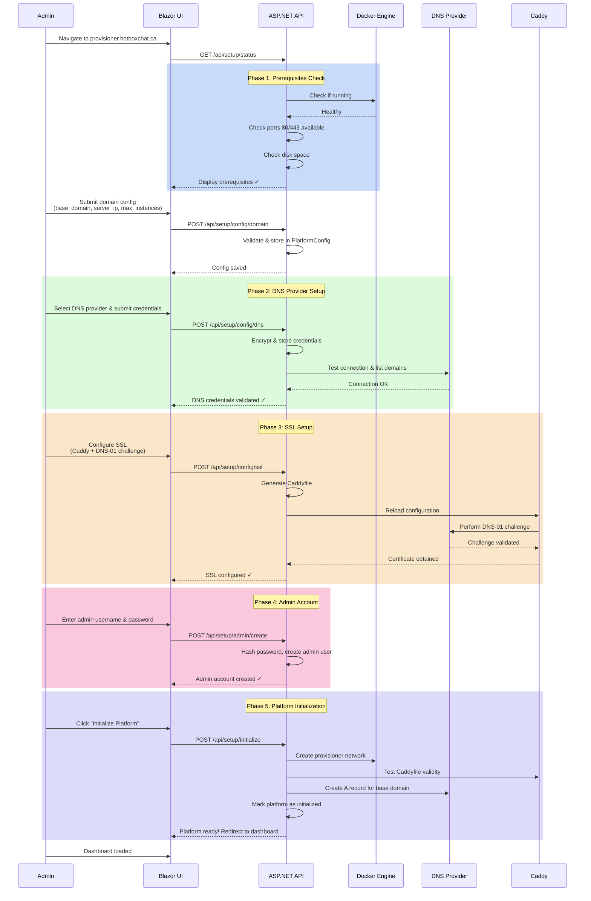
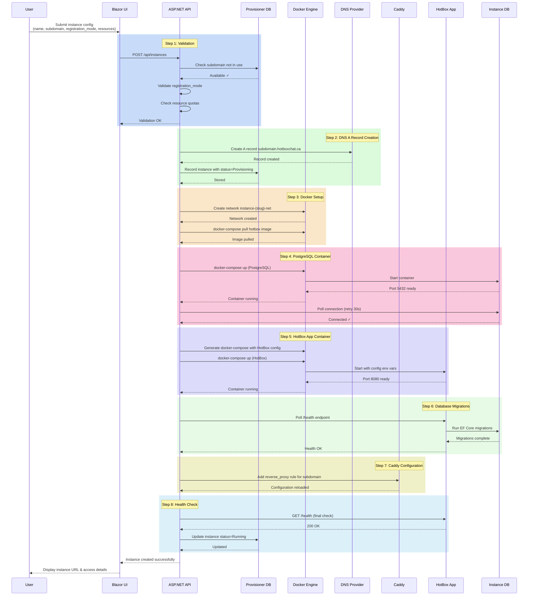
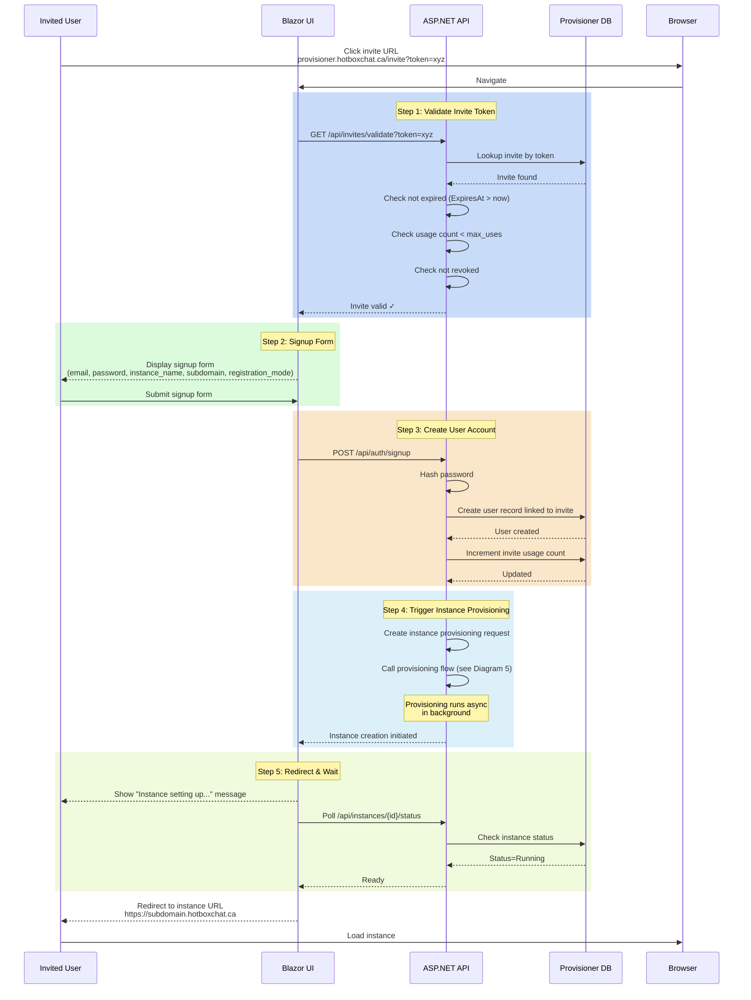
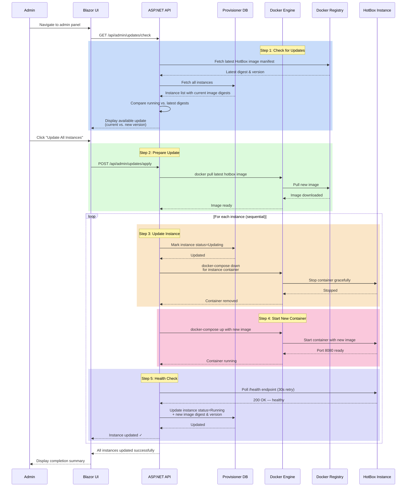
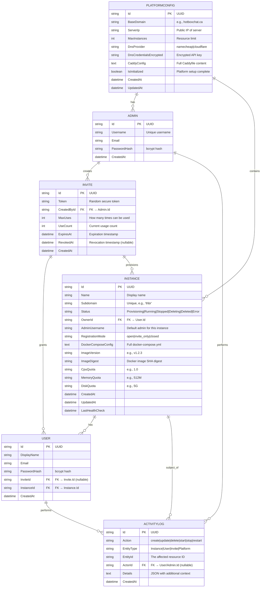
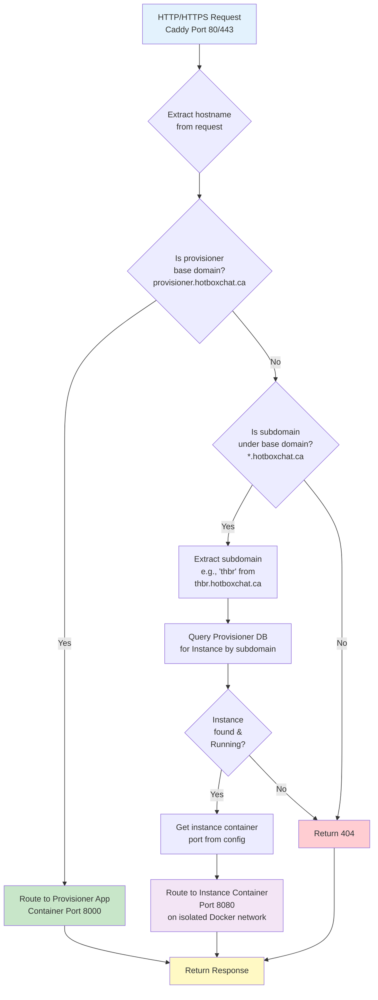
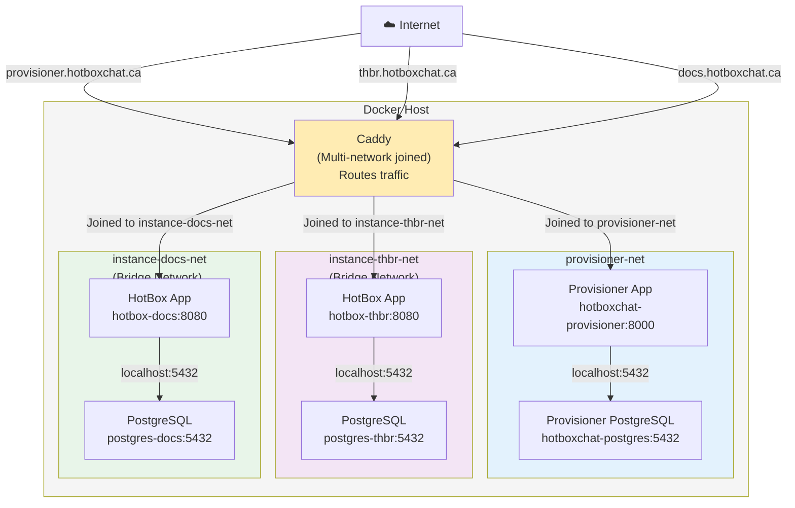

# HotBox Provisioner — Architecture & Flow Diagrams

This document contains comprehensive Mermaid diagrams illustrating the architecture, deployment, workflows, and data model of the HotBox Provisioner system.

## 1. System Architecture (C4 Context)

The HotBox Provisioner is a multi-tenant management platform that provisions isolated HotBox chat instances on a single server. Users interact with a Blazor WASM frontend and ASP.NET Core API, which orchestrates Docker containers and manages DNS/SSL via Caddy.

```mermaid
graph TB
    User["👤 User<br/>(Browser)"]
    DNS["🌐 DNS Provider<br/>(Namecheap/Cloudflare)"]

    subgraph Provisioner["HotBox Provisioner"]
        UI["Blazor WASM UI"]
        API["ASP.NET Core API"]
        DB[(PostgreSQL)]
    end

    subgraph Infrastructure["Single Server"]
        Docker["🐳 Docker Engine"]
        Caddy["Caddy<br/>(Reverse Proxy<br/>+ SSL)")
    end

    subgraph Instance1["Instance 1: 'thbr'"]
        HB1["HotBox App"]
        PG1[(PostgreSQL)]
    end

    subgraph Instance2["Instance 2: 'docs'"]
        HB2["HotBox App"]
        PG2[(PostgreSQL)]
    end

    User -->|HTTPS| Browser["Browser"]
    Browser -->|API Calls| Caddy
    Caddy -->|provisioner.hotboxchat.ca| API
    Caddy -->|thbr.hotboxchat.ca| HB1
    Caddy -->|docs.hotboxchat.ca| HB2

    API -->|Read/Write| DB
    API -->|Create/Manage Containers| Docker
    API -->|Update DNS Records| DNS

    Docker -->|Hosts| HB1
    Docker -->|Hosts| HB2
    Docker -->|Hosts| Caddy

    HB1 -->|Query| PG1
    HB2 -->|Query| PG2
```

---

## 2. Infrastructure & Deployment Topology

This diagram shows the single-server layout with Caddy as the central routing layer, the provisioner app with its database, and multiple isolated instance clusters on their own Docker networks.



---

## 3. Instance Lifecycle State Diagram

Each provisioned instance transitions through various states during its lifecycle. This state machine tracks the operational status and supports transitions like create, start, stop, update, and delete.



---

## 4. Platform Setup Flow (Initialization)

When an administrator first accesses the HotBox Provisioner, a guided setup process configures the platform infrastructure. This sequence shows the steps from prerequisites check through platform initialization.



---

## 5. Instance Provisioning Flow

When a user creates a new chat instance, the provisioner orchestrates Docker, DNS, and database setup. This sequence traces the complete provisioning workflow from validation through health check.



---

## 6. Invite Signup & Provisioning Flow

When an invited user clicks their invite link, they are guided through account creation and immediately provisioned with their own instance. This flow combines invite validation, signup, and provisioning.



---

## 7. One-Click Update Flow

Administrators can update all instances to the latest HotBox version. The provisioner checks for newer images and coordinates rolling updates with health checks.



---

## 8. Data Model (Entity-Relationship Diagram)

The provisioner's data model captures platform configuration, instances, users, invites, and activity logs.



---

## 9. Request Routing Diagram (Caddy Reverse Proxy)

Every HTTP/HTTPS request enters through Caddy, which routes based on the hostname. This flowchart shows the routing logic for provisioner requests, instance requests, and error cases.



---

## 10. Docker Network Topology

The provisioner uses Docker networks to isolate infrastructure and instances. Each instance gets its own network connecting its HotBox app and PostgreSQL containers, while Caddy connects to all networks for routing.



---

## Key Design Principles

1. **Isolation**: Each instance runs on its own Docker network with dedicated PostgreSQL, ensuring multi-tenancy isolation.

2. **Single Entry Point**: Caddy serves as the sole reverse proxy, handling SSL termination, wildcard certificates, and routing.

3. **DNS-01 Challenge**: SSL certificates are provisioned automatically via DNS-01 validation, requiring no manual certificate management.

4. **Stateless Provisioning**: The provisioner stores all instance configuration in docker-compose files, making deployment idempotent.

5. **Health-Driven Orchestration**: All async operations (provisioning, updates) use health checks to verify readiness before marking state changes.

6. **Encrypted Secrets**: DNS provider credentials and other sensitive data are encrypted at rest in the provisioner database.

7. **Audit Trail**: All administrative actions (create, update, delete) are logged in ActivityLog for compliance and debugging.

---

## Related Documentation

- **[DNS Setup Guide](./dns-setup.md)** — Detailed steps for configuring Namecheap or Cloudflare DNS with Caddy
- **[Deployment Guide](../deployment/)** — Instructions for deploying the provisioner and instances
- **[Configuration Reference](../architecture/configuration-reference.md)** — Environment variables and settings

---

*Last updated: 2026-03-10*
